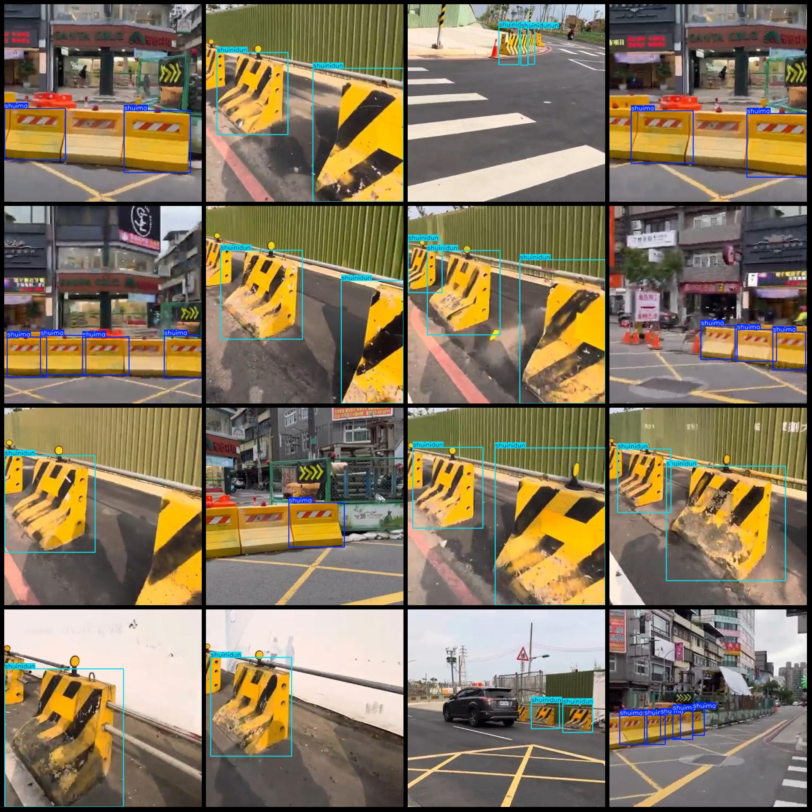
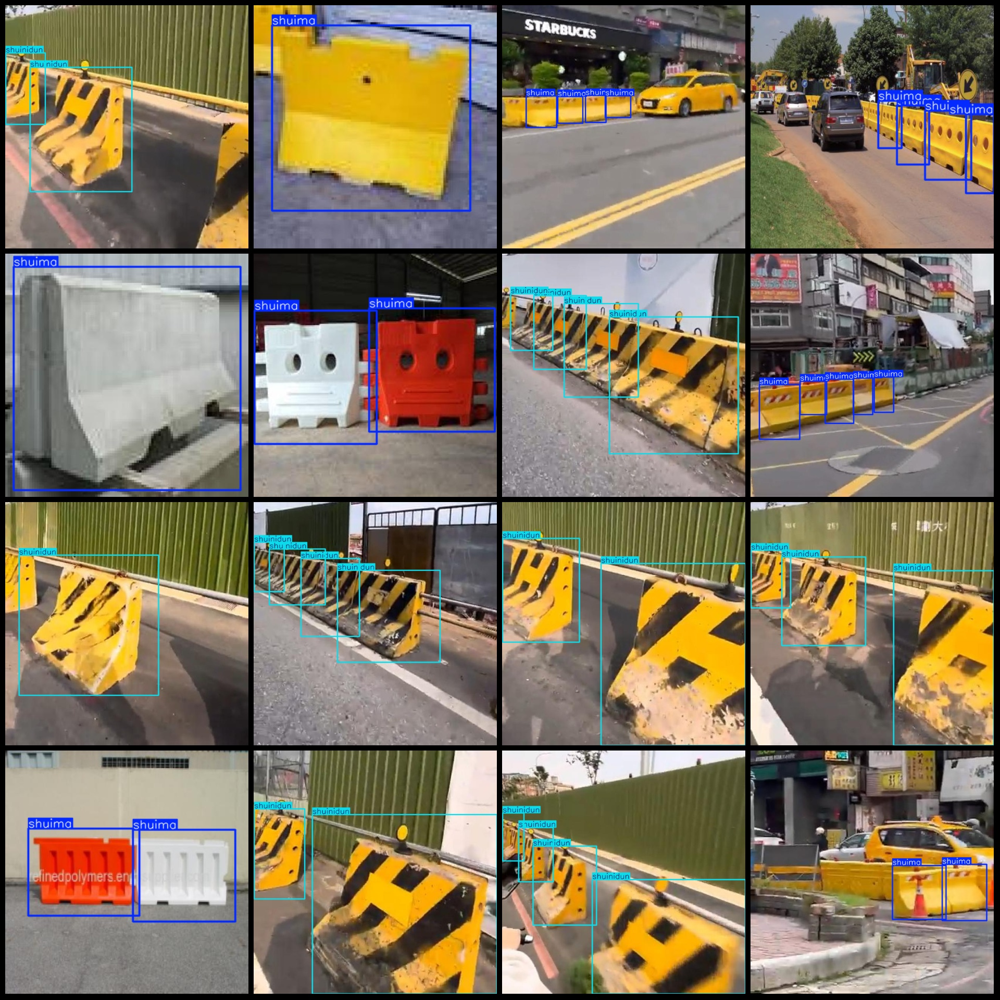

# Road Obstacles Concrete Barrier Water Barrier Separation Barrier Detection Dataset VOC+YOLO Format 1343 Images in 2 Categories

Dataset format: Pascal VOC format + YOLO format (without the split path's txt file, only including jpg images as well as corresponding VOC format xml files and YOLO format txt files)
Number of images (jpg file count): 1343
Number of annotations (xml file count): 1343
Number of annotations (txt file count): 1343
Number of annotation categories: 2
Annotation category name (notice that the order of categories in YOLO format does not match this, but is based on the "labels" folder's "classes.txt"): ["water_barrier", "concrete_barrier"]
The number of bounding boxes for each category:
- water_barrier (water barrier) = 1481
- concrete_barrier (concrete barrier) = 1911
Total bounding box count: 3392
The number of images occupied by each category:
- water_barrier (water barrier) = 590
- concrete_barrier (concrete barrier) = 753
Image resolution: Images with various resolutions, such as 416x416, 640x640, etc.
Used labeling tool: labelImg
Labeling rules: Draw a rectangular box around the category
Important note: The dataset does not include a training/validation/test split; you need to do that yourself.
Special declaration: This dataset does not guarantee any accuracy of the trained model or weight files.
Image preview:
Annotation example:

## Images

Here is a pay link on Stripe ( https://buy.stripe.com/3cs8yP7sY87d0vu9AB ). Please contact me lonlonago@foxmail.com after funding $89, and I will send you a complete data files , thank you!

